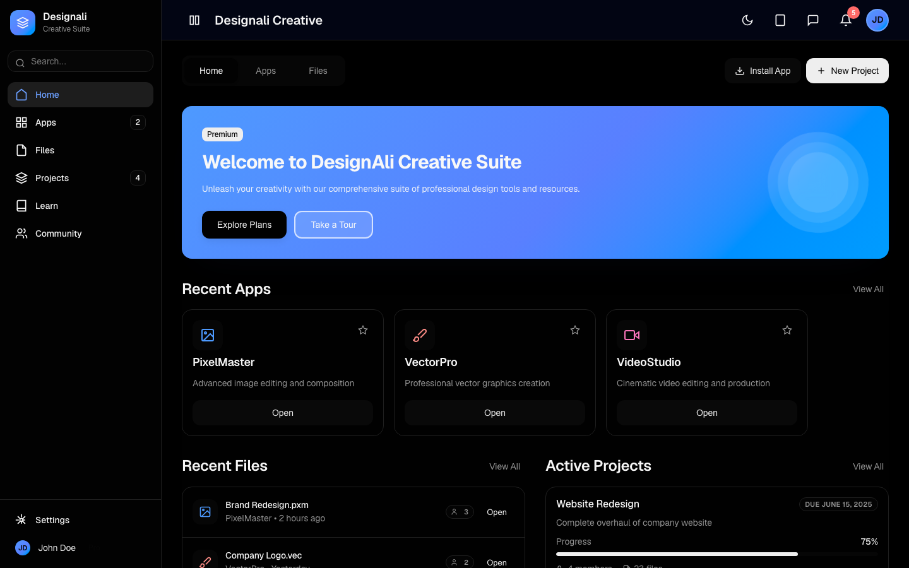
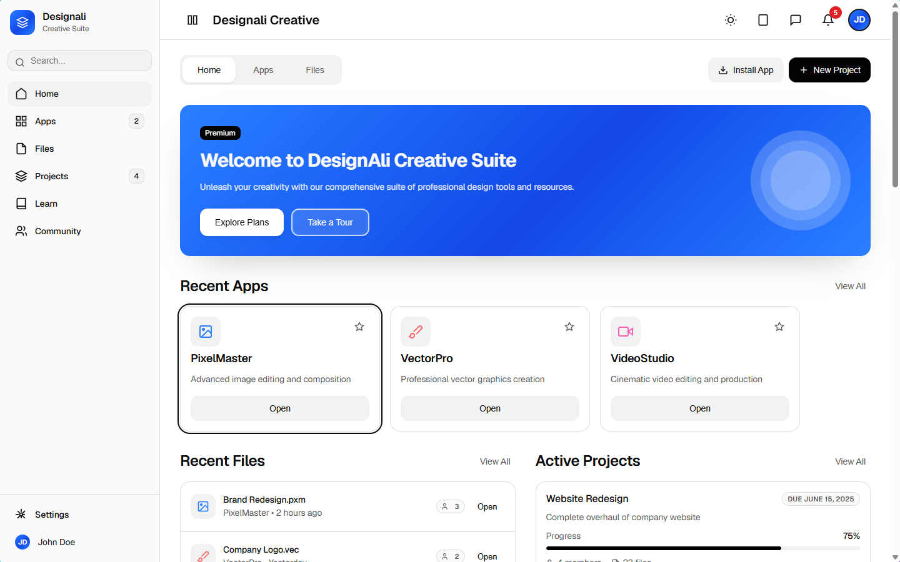

# Design System

[English](README.md) | [简体中文](README.zh-CN.md)

这是一个以 Aurora 风格为灵感、面向现代 SaaS 产品的设计系统演示项目。它将语义化设计令牌、可复用 UI 组件和富有质感的预览页面结合在一起，帮助你更直观地感受视觉语言在真实界面中的表现。

## 亮点

- 具有层次分明渐变、深度感和可访问对比度的精致视觉系统
- 为设计原则、样式和组件提供清晰的文档说明
- 提供交互式预览页，展示系统在真实场景中的视觉效果

## 项目结构

- [aurora/README.md](aurora/README.md) — 设计系统文档总览
- [aurora/preview/index.html](aurora/preview/index.html) — 交互式预览页面
- [aurora/preview/styles.css](aurora/preview/styles.css) — 预览样式与动画效果

## 本地预览

直接在浏览器中打开 [aurora/preview/index.html](aurora/preview/index.html)，或者在本地启动一个静态服务：

```bash
python3 -m http.server 8000
```

随后访问 http://localhost:8000/aurora/preview/

## 效果预览




## 文档

- [aurora/DESIGN.md](aurora/DESIGN.md)
- [aurora/STYLES.md](aurora/STYLES.md)
- [aurora/COMPONENTS.md](aurora/COMPONENTS.md)
